# Capstone Project
```
Dang Le Dang Khoa
Build a Stock Price Predictor
```

# Definition
## Project Overview
- Investment firms, hedge funds, and even individuals have been using financial models to better understand market behavior and make profitable investments and trades. A wealth of information is available in the form of historical stock prices and company performance data, suitable for machine learning algorithms to process.
- For this project, the task is to build a stock price predictor that takes daily trading data over a certain date range as input, and outputs projected estimates for given query dates. Note that the inputs will contain multiple metrics, such as opening price (Open), highest price the stock traded at (High), how many stocks were traded (Volume) and closing price adjusted for stock splits and dividends (Adjusted Close); the system only needs to predict the Adjusted Close price.
- Dataset downloaded from: [http://finance.yahoo.com](http://finance.yahoo.com)

    _Example_: GOOG stock data

| __Dates__ | __Open__ | __High__  | __Low__  | __Close__ | __Adj Close__  | __Volume__ |
|:---------:|:--------:|:---------:|:--------:|:---------:|:--------------:|:----------:|
| 2009-02-17|172.135422|172.423553 |168.747467|170.222870 | 170.222870     |   11434600 |
| 2009-02-18|172.498062|175.548233 |169.159775|175.414093 | 175.414093     |   12127300 |
| 2009-02-19|177.580017|178.737488 |169.601898|170.212936 | 170.212936     |   10042200 |
| 2009-02-20|167.932755|173.332642 |166.417618|172.105621 | 172.105621     |   12515000 |
| 2009-02-21|172.378845|173.769791 |163.710220|163.963577 | 163.963577     |   10510000 |

- Inputs: Date and Adjusted Close

    _Example_: Time series input

| __Dates__ | __Adj Close__  |
|:---------:|:--------------:|
| 2009-02-17| 170.222870     |
| 2009-02-18| 175.414093     |
| 2009-02-19| 170.212936     |
| 2009-02-20| 172.105621     |
| 2009-02-21| 163.963577     |


    
- Output: Prediction Price at the current day based on historical data
- Optional output: Suggest Buy/Sell/Hold

## Problem Statement
- The main task here is to predict the current(t) based on historical data(t-1, t-2, ...)
- I suggest 2 different approaches:
    + Traditional supervised machine learning methods(Regressions)
    + A specific machine learning method for time series forecasting(ARIMA model)
- Subproblems have to be considered that time series data:
    + Are very noisy
    + Are different from tabular data that each data point related to each other
    + Contain time-dependent structures:
        - Level: the average value in the series
        - Trend: global increasing or decreasing
        - Seasonalities: repeating pattern of the series 

## Metrics
- Evalute models based on the error produced by predictions and observations
- RMSE(Root Mean Squared Error) definition:
    $$RMSE = \sqrt{\frac{\sum_{t \in N}(y_t - \hat{y}_t)^2}{N}}$$
- Reasons to choose RMSE:
    + Squaring error to have positive values
    + Putting more weight on large errors
- Cons of choosing RMSE:
    + Our data may have many outliers that affect the perfomance evaluation 

# Analysis
## Data Exploration
- Input data:
    + Datetime and Adjusted Close
    + 4 symbols: AAPL, GOOG, XOM, GLD
    + Datetime range: 8 years(from 01-01-2010 to 31-12-2017)


- Data preprocessing: Normalization


Observations in normalized series:
    + GOOG has a constantly increasing in trend
    + AAPL has a strong increase and fluctuation
    + XOM and GLD have the same pattern which trend components are low
    + So I choose 3 typical series for Price Predicting Model: AAPL, GOOG, XOM 

## Exploratory Visualization
- Global statistic: 

    _Mean, Standard deviation, Median, Sum_

| __Symbol__| __Mean__  | __Std__   | __Median__| __Sum__       |
|:---------:|:---------:|:---------:|:---------:|:-------------:|
| AAPL      | 3.743462  | 1.968410  | 3.252886  | 10938.396687  |
| GOOG      | 1.658303  | 0.722951  | 1.656681  |  4845.562630  |
| XOM       | 1.356500  | 0.197727  | 1.402289  |  3963.693878  |
| GLD       | 1.187735  | 0.176200  | 1.124818  |  3470.562110  |

    Observations:
        + AAPL has the highest variance and mean value
        + XOM and GLD has the lowest variance as visualization
        

- Rolling Statistic
    - Bollinger Band Analysis: 
    - Parameter: `windowsize=20, Year=2015`: Indicates the trend is resting or variating at the current time

$$ Upper\_band = Rolling\_mean + 2*std $$
$$ Lower\_band = Rolling\_mean - 2*std $$


- Lagged order analysis: Time-series data have a special property that current datapoint(t) strongly corellated to previous historical datapoints(t-1, t-2, ..., t-n)


    + AAPL
    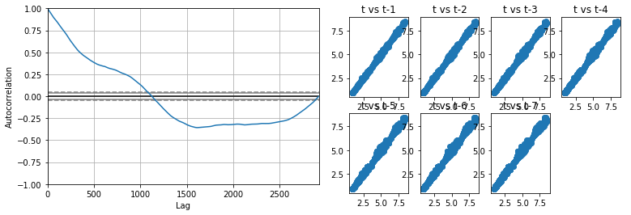

    + GOOG
    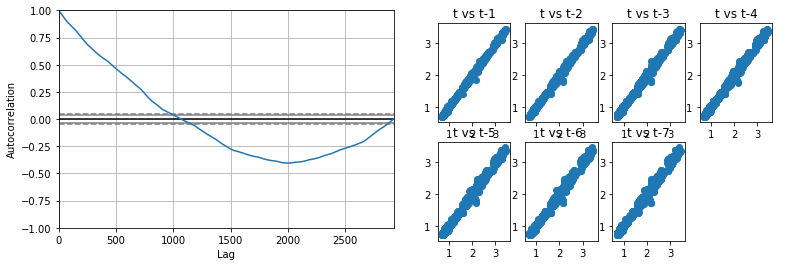

    + XOM
    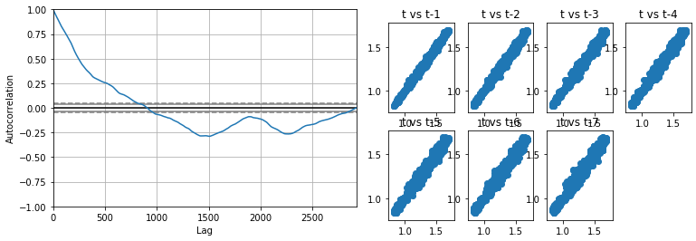

## Algorithms and Techniques
### Linear Regression Approach
#### Definition
- Multiple Linear Regression model
    $$y = m + a_1*x_1 + a_2*x_2 + ... + a_n*x_n$$
    + m: intercept
    + a_n: parameters of feature n
    + x_n: feature n
    + model parameters: (m, a_1, a_2, ..., a_n)
- Fitting model

    _Example_
$$y = m + a_0*x$$
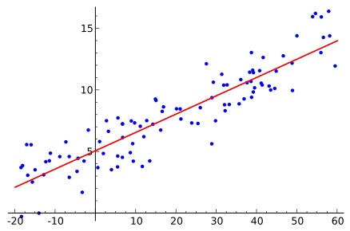

#### Feature engineering for Linear Regression
- For time series Regression, create lagged values as new features
    $$lag(n) = f(t-n) $$
    _Example_: lagged values with n = 7

| __Dates__ | __t__ |__t-1__    |__t-2__    |__t-3__    |__t-4__    |__t-5__    |__t-6__   |__t-7__|
|:---------:|:-----:|:---------:|:---------:|:---------:|:---------:|:---------:|:--------:|:-----:|
|2011-01-08 |1.020005|  1.020005|   1.015140|   1.007810|   0.996310|   1.000000|   1.00000| 1.00000|
|2011-01-09 |1.020005|  1.020005|   1.020005|   1.015140|   1.007810|   0.996310|   1.00000| 1.00000|
|2011-01-10 |1.016315|  1.020005|   1.020005|   1.020005|   1.015140|   1.007810|   0.99631| 1.00000|
|2011-01-11 |1.019293|  1.016315|   1.020005|   1.020005|   1.020005|   1.015140|   1.00781| 0.99631|
|2011-01-12 |1.020716|  1.019293|   1.016315|   1.020005|   1.020005|   1.020005|   1.01514| 1.00781|

- Fit the model by n features(t-1, t-2, ..., t-n) to predict the current value(x(t))
    $$x(t) = m + a_1*x(t-1) + a_2*x(t-2) + ... + a_2*x(t-2)$$
- Perform grid search to find the optimal lag order n based on Root Mean Squared Error(RMSE)

#### Why Linear Regression ?
- Firstly, I choose Linear Regression as a baseline model to compare with the ARIMA model
- The stock price prediction problem is similar to the regression problems(predict the current value based on historical data)


### ARIMA Approach
#### Definition
- ARIMA stands for Autoregressive Integrated Moving Average (Alternative name: Box-Jenkins Model)
- ARIMA is a forecasting technique that projects the future values of a series based on its own inertia
- Its main application is short-term forecasting requiring at least 40 historical data points
- ARIMA works best when data: 
    + Exhibits a stable or consistent pattern
    + Have a minimum amount of outliers

#### Models parameter
- ARIMA attempts to describe the movement in a stationary time series as a function of "autoregressive and moving avg"
    + AR(autoregressive)
    + MA(moving avg)
- Autoregressive Models: 
    $$X(t) = A(1)*X(t-1) + A(2)*X(t-2) +... + A(n)*X(t-n) + E(t)$$
    + X(t): the time-series
    + X(t-n):  time series lagged n
    + A(n): autoregressive parameters
    + E(t): the error term of the model
- Moving Average Models:
    $$X(t) = -B(1) * E(t-1) + E(t)$$
    + B(1): MA of order 1
    + E(t):  current error term
    + E(t-1): error in the previous period

#### Approach
- Mixed ARIMA model is built on 3 parameters (p,d,q)
    + p: lag order
    + d: degree of differencing
    + q: size of moving average window(order of moving average)
- Perform grid search to find the optimal orders (p,d,q) based on Root mean squared error(RMSE) 

#### Why ARIMA ?
- ARIMA is a specific model for time-series analysis, I choose it to compare its performance versus the linear regression model
- ARIMA has been proven that has a reliable accuracy, robustness over time-series prediction

## Benchmark
- The Linear Regression model will be compared with the ARIMA model
- Some Hypotheses I imply from Exploratory Visualization and Analysis:
    + Since AAPL time series data are strongly correlated, we can use more lagged values as input features thus the lagged order of ARIMA model would be set high
    + Otherwise, XOM time series are not strongly correlated, the lagged order would be lower for this series.
    + Though heavily affected by trend and fluctuation the ARIMA model tend to be less accurate in predicting AAPL and more accurate in predicting XOM series which is less affected by trend component and more stable

# Methodology
## Data Preprocessing
- Normalization
$$f(t) = \frac{f(t)}{f(0)}$$


- Why we need normalization
    + Compare multiple stocks easily in terms of variances, mean, median values 
    + Help with model convergence/stability

- Implementations
```python
df = df/df.iloc[0, :]
```

## Implementation
### Linear Regression 
1. Feature Engineering
    - Lagged values:
        + We need lagged values(from x(t-1) to x(t-n)) as input features for the linear regression model
            $$x(t) = m + a_1*x(t-1) + a_2*x(t-2) + ... + a_2*x(t-2)$$
        + How lagged features are created
            ```python
            while n < lagged_order:
                shift the series 1 step and add a new feature as x(t-n)
            Remove the empty entries of dataframe created by shifting
            ```
    - Examine correlation between lagged datapoints
        + Since my hypothesis is that we can predict the current in the series based on historical data, it is needed to check if the current value and previous values have a strong correlation.
        + A strong correlation indicates that our linear regression model has prediction lower errors
        + Thus, We can determine the lagged order suitable to generated as input features

        Example
        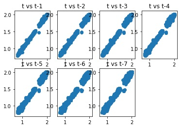
        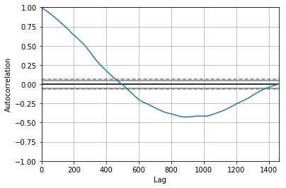
    - Implementations
        + Libraries

            ```python
            from pandas.plotting import autocorrelation_plot
            ```
        + APIs

            ```python
            # Process the input time-series dataframe
            # Return the dataframe corresponding to the lags-order
            generate_lag(dataframe, lags)

            # Plot the correlation of t vs (t-n)
            plot_correlation(dataframe, lags)
            ```
    
2. Split data into trainning/validation/test set
    - Steps
        + Trainning set: train the model
        + Validation set: validate the RMSE of the trained model, We choose the model which has lowest RMSE on validation
        + Test set: Final evaluation of Linear Regression approach

        Example
        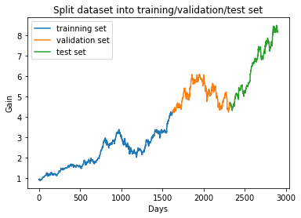
    - Implementations
        + APIs

            ```python
            # Split the dataset into 2 parts
            # First part: 70% of the series
            # Second part: 30% latter of the series
            split_dataset(dataset, split_percentage=0.7):
            ```
3. Perform grid search to find optimal parameters
    - Steps
        + Examine which model has the lowest RMSE on validation set
        + Hyper-parameters: (m, a_1, a_2, ..., a_n) and the corresponding lagged order

            ```python
            for lag in lag_values:
                model = fit(trainning_set(X, y, lag))
                y_hat = model.predict(validation_set(X, lag))
                error = RMSE(y - y_hat)
                best_params = params with minimum error
            return best_params
            ```
    - Implementations
        + Libraries

            ```python
            from sklearn.linear_model import LinearRegression
            ```
        + APIs

            ```python
            # Train a Linear Regression model with trainning set
            # Return the predictions produced by testing set X
            Linear_Regression_predict(train_X, train_y, test_X)

            # Perform a grid search provided by trainning set and validation set
            # Find the optimal lagged order within the range of lag_values
            Linear_Regression_grid_search(train_X, train_y, valid_X, valid_y, lag_values)
            ```

4. Evaluate based on RMSE and visualization
    - Steps
        + Fit the best model with testing dataset
        + Visualize and evaluate the model

        Example
        
    - Implimentations
        + Libraries

            ```python
            from sklearn.metrics import mean_squared_error
            from math import sqrt
            ```
        + APIs

            ```python
            rmse = sqrt(mean_squared_error(validation_set, predictions))
            ```


### ARIMA modeling
1. Split data into trainning/validation/test set
    - Steps
        + Trainning set: train the model
        + Validation set: validate the RMSE of the trained model, We choose the model which has lowest RMSE on validation
        + Test set: Final evaluation of Linear Regression approach

        Example
        
    - Implimentations
        + APIs

            ```python
            # Split the dataset into 2 parts
            # First part: 70% of the series
            # Second part: 30% latter of the series
            split_dataset(dataset, split_percentage=0.7):
            ```
2. Perform grid search to find optimal parameters
    - Hyper-parameters: (p,d,q) of the model

        ```python
        for each (p,q,d) in order_values:
            model = fit(trainning_set(X, y, p, q, d))
            y_hat = model.predict(validation_set(X, p, q, d))
            error = RMSE(y - y_hat)
            best_params = params with minimum error
        return best_params(p,q,d)
        ```
    - Implimentations
        + Libraries

            ```python
            from statsmodels.tsa.arima_model import ARIMA
            ```
        + APIs
            ```python
            # Train a ARIMA model based on the trainning set with the correspondent order(p,d,q)
            # Return predictions provided by testing set
            train_ARIMA(train, test, orders)

            # Perform a grid search provided by trainning set and testing set
            # Find the optimal (p,d,q) order within the range of prvided p_values, d_values, q_values
            grid_search_ARIMA(train, test, p_values, d_values, q_values)
            ```
3. Evaluate based on RMSE and visualization
    - Steps
        + Fit the best model with testing dataset
        + Visualize and evaluate the model

        Example
        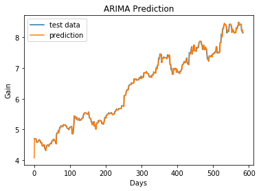
    - Implimentations
        + Libraries

            ```python
            from sklearn.metrics import mean_squared_error
            from math import sqrt
            ```
        + APIs

            ```python
            rmse = sqrt(mean_squared_error(validation_set, predictions))
            ```

## Refinement
- Use the grid search to find the optimal parameters
```python
    for parameter in pre_defined_parameters:
        model = fit(trainning_set(X, y, parameter))
        y_hat = model.predict(validation_set(X))
        error = RMSE(y - y_hat)
        best_params = params with minimum error
return best_params
```
- Linear Regression parameter: lagged order

    Example
```
lag order = 1 ----- rmse = 0.0681184299485
lag order = 2 ----- rmse = 0.0681223257362
lag order = 3 ----- rmse = 0.06815698406
lag order = 4 ----- rmse = 0.0681397973319
lag order = 5 ----- rmse = 0.0681668500541
lag order = 6 ----- rmse = 0.0680510359783
lag order = 7 ----- rmse = 0.0680368919466
lag order = 8 ----- rmse = 0.0681167632127
lag order = 9 ----- rmse = 0.0681144323532
lag order = 10 ----- rmse = 0.0682450179183
lag order = 11 ----- rmse = 0.0682020982234
lag order = 12 ----- rmse = 0.0682066932863
lag order = 13 ----- rmse = 0.068346349801
lag order = 14 ----- rmse = 0.0686007666681
lag order = 15 ----- rmse = 0.0685934882764
lag order = 16 ----- rmse = 0.0686576451934
lag order = 17 ----- rmse = 0.0686604377645
lag order = 18 ----- rmse = 0.0686682514038
lag order = 19 ----- rmse = 0.0687323543295
lag order = 20 ----- rmse = 0.0687804499171
```
```
Best lag value: 7 which rmse: 0.068
```

- ARIMA parameter: corresponding (p,d,q)

    Example
```
(p,d,q) = (0, 0, 0) ----- rmse = 2.48364131894
(p,d,q) = (0, 0, 1) ----- rmse = 1.26650933811
(p,d,q) = (0, 1, 0) ----- rmse = 0.0679057555661
(p,d,q) = (0, 1, 1) ----- rmse = 0.0679954382993
(p,d,q) = (0, 1, 2) ----- rmse = 0.0680501205292
(p,d,q) = (0, 2, 0) ----- rmse = 0.0959062918676
(p,d,q) = (0, 2, 1) ----- rmse = 0.067961162253
(p,d,q) = (1, 0, 0) ----- rmse = 0.0678983071
(p,d,q) = (1, 1, 0) ----- rmse = 0.0679942677575
(p,d,q) = (1, 2, 0) ----- rmse = 0.0837961125124
(p,d,q) = (2, 1, 0) ----- rmse = 0.0680524002794
(p,d,q) = (2, 2, 0) ----- rmse = 0.0783914395604
(p,d,q) = (3, 1, 0) ----- rmse = 0.0680730399881
(p,d,q) = (3, 1, 1) ----- rmse = 0.0680880439241
(p,d,q) = (3, 2, 0) ----- rmse = 0.0759859093161
(p,d,q) = (4, 1, 0) ----- rmse = 0.0681052674349
(p,d,q) = (4, 1, 1) ----- rmse = 0.0680237050631
(p,d,q) = (4, 2, 0) ----- rmse = 0.0752259829098
(p,d,q) = (4, 2, 2) ----- rmse = 0.0680372743866
(p,d,q) = (5, 1, 0) ----- rmse = 0.0680484192109
(p,d,q) = (5, 1, 2) ----- rmse = 0.0680657372321
(p,d,q) = (5, 2, 0) ----- rmse = 0.0738266456692
(p,d,q) = (5, 2, 1) ----- rmse = 0.0681019681848
(p,d,q) = (5, 2, 2) ----- rmse = 0.068107805233
```
```
Best order (p,d,q):  (1, 0, 0) which rmse = 0.068
```
    
# Results
## Model Evaluation and Validation
### AAPL
- Linear Regression model

```
    Best lag value: 7
    Validation RMSE: 0.068
    Test RMSE: 0.061
```
- ARIMA model

```
    Best order (p,d,q): (1, 0, 0)
    Validation RMSE: 0.068
    Test RMSE: 0.066
```
- Evaluation
    + Both models work well on validation dataset
    + For testing set, the Regression model seems to perform better

### GOOG
- Linear Regression model
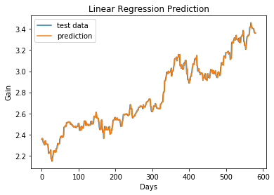
```
    Best lag value: 1
    Validation RMSE: 0.027
    Test RMSE: 0.023
```
- ARIMA model
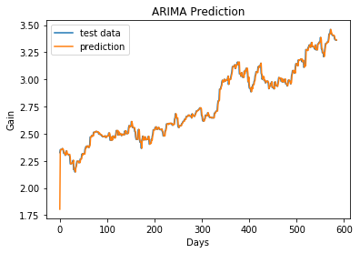
```
    Best order (p,d,q): (0, 1, 0)
    Validation RMSE: 0.027
    Test RMSE: 0.031
```
- Evaluation
    + Both models work well on validation dataset
    + For testing set, the ARIMA has a poor performance comapared to the Regression model

### XOM
- Linear Regression model
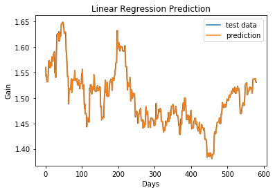
```
    Best lag value: 4
    Validation RMSE: 0.016
    Test RMSE: 0.011
```
- ARIMA model
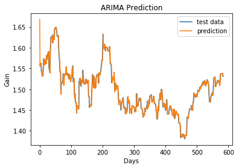
```
    Best order (p,d,q): (4, 0, 2)
    Validation RMSE: 0.016
    Test RMSE: 0.012
```
- Evaluation
    + Both models work well on validation dataset
    + For testing set, both models have the same performance with low errors

## Robustness
- Test Robustness by predicting t+n days ahead(n=0,1,2,3,4,5,6,7) based on t-1,t-2... 
- Results
    ```
    Predict t
    Best lag value: 7, validation rmse: 0.068
    Test RMSE: 0.060

    Predict t + 1
    Best lag value: 6, validation rmse: 0.096
    Test RMSE: 0.086

    Predict t + 2
    Best lag value: 1, validation rmse: 0.117
    Test RMSE: 0.106

    Predict t + 3
    Best lag value: 1, validation rmse: 0.135
    Test RMSE: 0.124

    Predict t + 4
    Best lag value: 1, validation rmse: 0.151
    Test RMSE: 0.141

    Predict t + 5
    Best lag value: 1, validation rmse: 0.164
    Test RMSE: 0.156

    Predict t + 6
    Best lag value: 1, validation rmse: 0.176
    Test RMSE: 0.168

    Predict t + 7
    Best lag value: 1, validation rmse: 0.185
    Test RMSE: 0.182
    ```
- Explaination
    + RMSE in both validation and test set increasing
    + Best lagged order reduced to 1
    + We can imply that the model is not robust after predicting 2 days ahead

## Justification
- The Linear Regression model outperforms ARIMA model in nearly every cases
- As prediction 
    + The accuracy of ARIMA model is low on AAPL and high on XOM series
    + Linear Regression model uses a high lagged order to predict
- Wrong hypothesis:
    + ARIMA model predicting XOM series needs complicated parameters
    + ARIMA model predicting GOOG series has a low accuracy

# Conclusion
## Free-Form Visualization
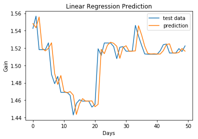
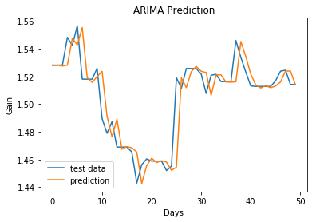

- If we look closely, the predicted series tend to be a lagged version of the actual series 
- Though we have a low RMSE result but I think it is not the best criteria to evaluate the stock predictor or time-series data in general
- I guess it is useless to predict real stock data

## Reflection
- The ARIMA model accuracy is low which is interestingly unpredictable
- The time required for training ARIMA model is high(~12 hrs for grid searching optimization)
- My hypothesis is that the ARIMA model is better than the Linear Regression model if there are no trend but the Linear Regression model seem to be strong enough to predict this nonconventional data
- Based on the results, the ARIMA model works poorly with the time-series which have trend components like AAPL or GOOG stock data

    
## Improvement
- For ARIMA model we can remove the trend component before applying model fitting
- We can remove the trend component by 
    + Subtract the time series by the previous value
$$ x(t) = x(t) - x(t-1)$$
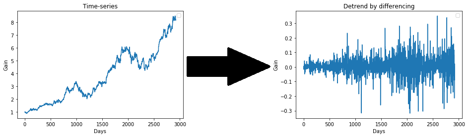

    + Subtract the time series by the predicted value from a simple model
```
model = linearRegression()
predictions = model.fit(X)
X = X - predictions
```
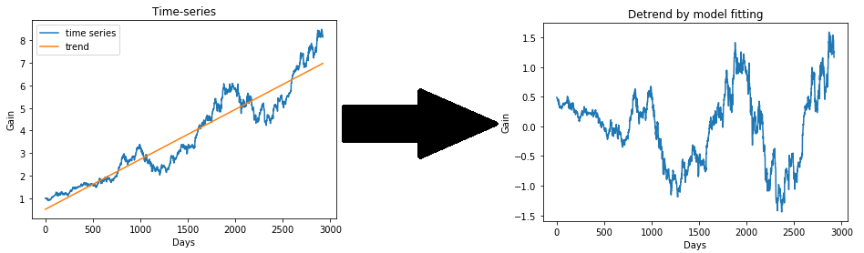
- Then used it as inputs for ARIMA models

## Challenges
- Time-series prediction is a non-trivial topic, I do not know how to approach it at the first time
- RMSE or order error metrics are useless in predicting time-series data

# References
1. [https://www.quora.com/What-is-ARIMA](https://www.quora.com/What-is-ARIMA)
2. [https://www.quora.com/What-are-Bollinger-Bands](https://www.quora.com/What-are-Bollinger-Bands)
3. [https://en.wikipedia.org/wiki/Linear_regression](https://en.wikipedia.org/wiki/Linear_regression)
4. [Udacity - Machine Learning for Trading](https://www.udacity.com/course/machine-learning-for-trading--ud501)
5. [https://stats.stackexchange.com/questions/84321/why-and-when-do-we-normalize-time-series-data](https://stats.stackexchange.com/questions/84321/why-and-when-do-we-normalize)
6. [https://machinelearningmastery.com/time-series-trends-in-python/](https://machinelearningmastery.com/time-series-trends-in-python/)
