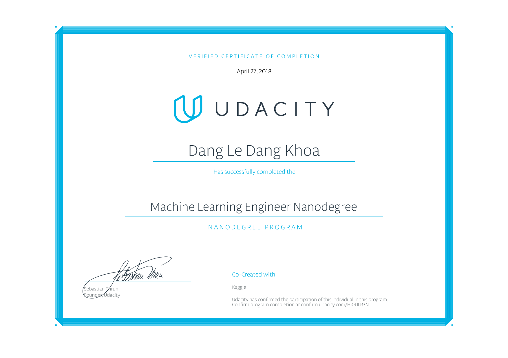

## Udacity - Machine Learning Engineer Nanodegree
__Projects__

1. Titanic Survival Exploration - Prediction
2. Boston Housing Price - Regression
3. Finding Donors for Charity ML - Classification
4. Customer Segments - Unsupervised Learning Clustering
5. Build a smart cab - Reinforcement Learning
6. Dog Breed Classification - Deep Learning
7. Build a stock price predictor - Capstone

__Additional Courses__
- Machine learning for finance

